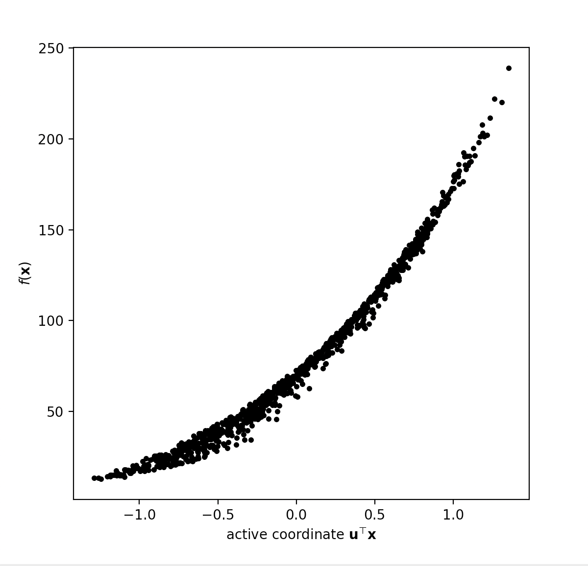

# PSDR: Parameter Space Dimension Reduction Toolbox
[](https://psdr.readthedocs.io/en/latest/?badge=latest)
[](https://travis-ci.org/jeffrey-hokanson/PSDR)
[](https://coveralls.io/github/jeffrey-hokanson/PSDR?branch=master)

**Author**: Jeffrey M. Hokanson, Postdoctoral Fellow at the University of Colorado Boulder (jeffrey@hokanson.us)


## Introduction
Given a function mapping some subset of an m-dimensional space to a scalar value
<p align="center">

</p>

*parameter space dimension reduction* seeks to identify a low-dimensional manifold
of the input along which this function varies the most.
Frequently we will choose to use a linear manifold
and consequently identify linear combinations of input variables along 
which the function varies the most.

We emphasize that this library is for parameter space dimension reduction
as the term 'dimension reduction' often appears in other contexts.
For example, model reduction is often referred to as dimension reduction
because it reduces the state-space dimension of a set of differential equations,
yielding a smaller set of differential equations.

## Simple example

One basic use of the library is to identify an active subspace using
the outer product of gradients:

```python
import psdr, psdr.demos
fun = psdr.demos.Borehole()    # load a test problem
X = fun.domain.sample(1000)    # sample points from the domain with uniform probabilty
grads = fun.grad(X)            # evaluate the gradient at the points in X
act = psdr.ActiveSubspace()    # initialize a class to find the Active Subspace
act.fit(grads)                 # estimate the active subspace using these Monte-Carlo samples
print(act.U[:,0])              # print the most important linear combination of variables

>>> array([ 9.19118904e-01, -2.26566967e-03,  2.90116247e-06,  2.17665629e-01,
        2.78485430e-03, -2.17665629e-01, -2.21695479e-01,  1.06310937e-01])
```

We can then create a *shadow plot* showing the projection of the input to this function
onto a one-dimensional subspace spanned by the important linear combination identified above

```python
import matplotlib.pyplot as plt
fX = fun(X)                    # evaluate the function at the points X
act.shadow_plot(X, fX)         # generate the shadow plot
plt.show()                     # draw the results
```

<p align="center">

</p>

We say this function is has low-dimensional structure since the output of the function
is well described by the value of this one linear combination of its input parameters.


## Documentation
For further documentation, please see our page on [Read the Docs](https://psdr.readthedocs.io/en/latest/).


## Similar Software

* [SMT: Surrogate Modeling Toolbox](https://smt.readthedocs.io/en/latest/) ([github](https://github.com/SMTorg/smt))


## Contributing
I welcome contributions to this library,
particularly of test functions similar to those in `psdr.demos`.
Please submit a pull request along with unit tests for the proposed code.
If you are submitting a complex test function that requires calling code outside of Python,
please submit a Docker image along with a docker file generating that image
(see the OpenAeroStruct demo function for an example of how to do this).

## Contributors

* Zach Grey 
* Lakshya Sharma 
